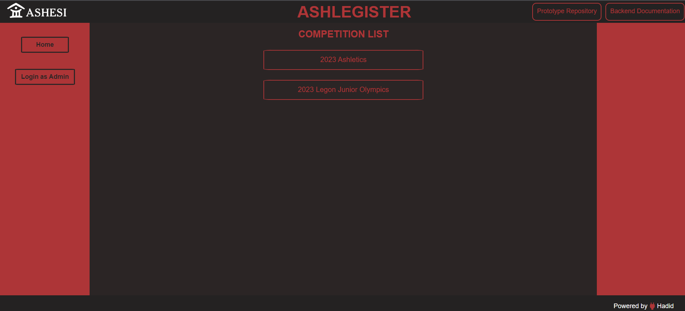

<p align="center">


</p>



## 💥 Introduction

Ashlegister is a web app for organizing and managing track/athletics events in a paperless manner. It is built using React for frontend, FastAPI for the backend, and Firebase Realtime DB  for the database.


## 💡 Why did I build this?

Last summer, I participated in a couple of track meets in Kumasi, Ghana, West Africa. I noticed that the lineups and results of the races were all documented on paper by hand. As a result of this, it was extremely difficult to get the results since there was no centralized place where they were posted. After asking one person to the next, I realized that we could make use of a web app that would allow the complete organization and centralization of competitions. So I decided to build one. This specific project will be used for school <a href src="https://www.ashesi.edu.gh"> Ashesi University </a> but long term the plan is to scale to the national level.

## 🛠️ Local development

To ensure that you are able to install everything properly, I would recommend you to have <b>Git</b>, <b>NPM</b>, <b>Node.js</b> and <b>Python</b> installed.


Start with setting up the Local Project Environment:

```sh
git clone https://github.com/ariffdev/Ashlegister.git
cd Ashlegister
```


Now we will add the environment variables in the client/ and server/

 - Create a .env file in the api folder according to .example.env given

 - Create a <a href="">Firebase Project</a>

 - Setup the firebase credentials according to the .example.env

Once you run the Commands and get environment variables and everything fine, we are all set to run the app ✔️

<ins> Frontend </ins>

On the root level run the following commands:

```sh
cd client
npm install
npm run dev
```


<ins> Backend </ins>

Open another terminal and on the root level run the following commands:

```sh
cd api
python3 -m venv venv
source venv/bin/activate
pip install -r requirements.txt
uvicorn app:app --reload
```


## 🥁 Features
Ashlegister provides competition organizers with the ability to:

-  Create competitions
- Add races
- Add athletes
- Add race results
- Host the results so they can be viewed by everyone
